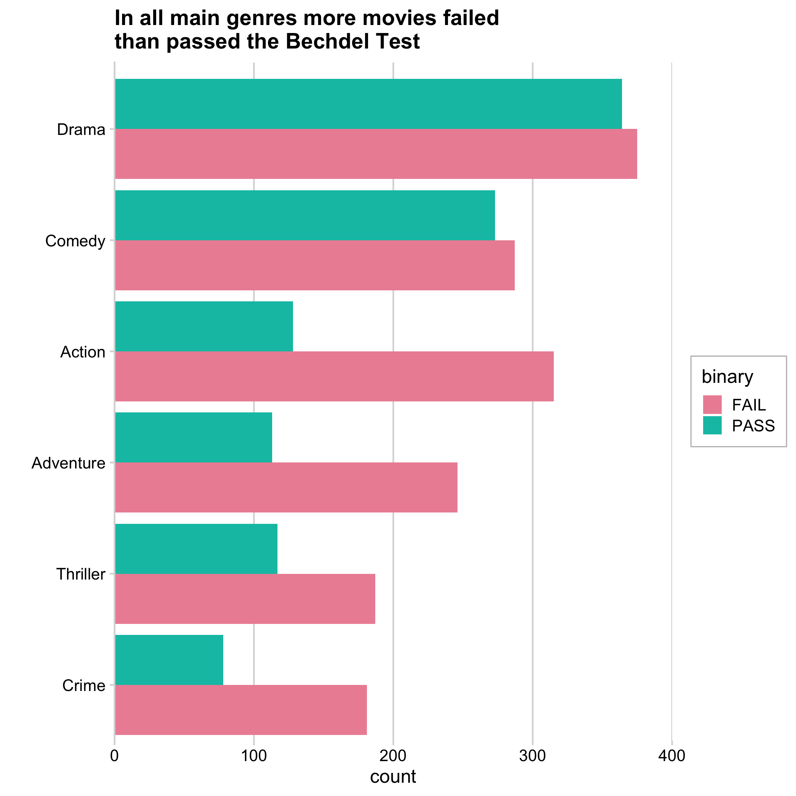
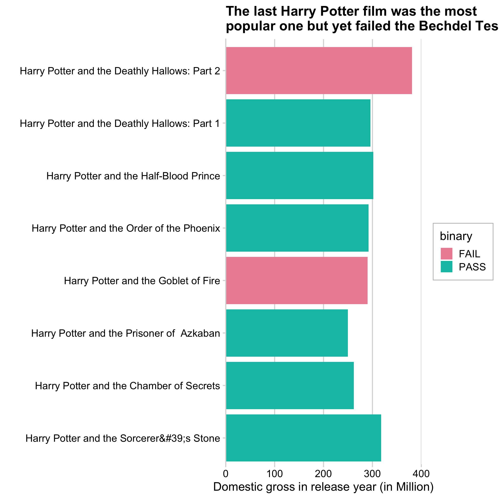
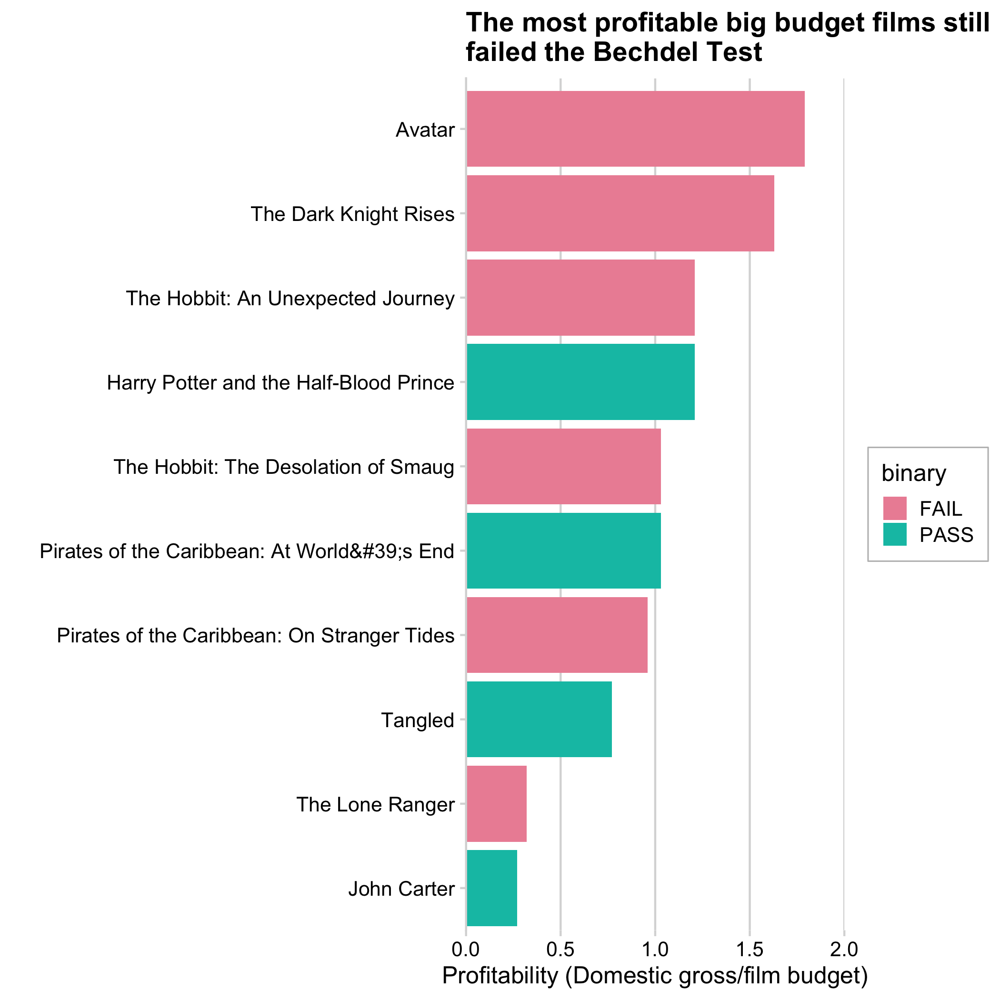

```{r setup, include=FALSE}
knitr::opts_chunk$set(echo = FALSE)

# Learn more about creating websites with Distill at:
# https://rstudio.github.io/distill/website.html

```

# Bechdel Test 


>The Bechdel test also known as the Bechdel–Wallace test, is a measure of the representation of women in fiction. It asks >whether a work features at least two women who talk to each other about something other than a man. The requirement that the >two women must be named is sometimes added. - Wikipedia

**Here your can learn more about the [_Bechdel test_](https://en.wikipedia.org/wiki/Bechdel_test)**

## Have a look at my Bechdel Test Visualizations!

**Movie Genres**

This bar chart compares the movies in the six main genres in regard to their Bechdel test results.



**Harry Potter Movies**

This bar chart compares the 7 Harry Potter movies in regard to their Bechdel test results.


**Big Budget Movies**

This bar chart shows the top eight big budget movies and their profitability. It examines whether their could be a relation to those movies' Bechdel Test results .


