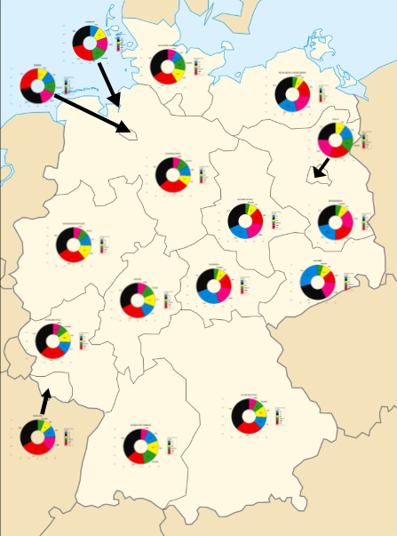

```{r setup, include=FALSE}
knitr::opts_chunk$set(echo = FALSE)

# Learn more about creating websites with Distill at:
# https://rstudio.github.io/distill/website.html

```

# Bundestagswahl

>Die Wahl zum 19. Deutschen Bundestag fand am 24. September 2017 statt.Die Wahlbeteiligung betrug 76,2 %, etwa 5 Prozentpunkte mehr als 2009 (70,8 %) und 2013 (71,5 %) und steht dem Abwärtstrend, den es seit der bisherigen Höchstmarke von 1972 (91,1 %) gibt, entgegen. - Wikipedia

**Hier gibt es noch mehr Informationen zur  [_Bundestagswahl 2017_](https://de.wikipedia.org/wiki/Bundestagswahl_2017)**

## Meine Visualisierung zur Bundestagswahl 2017

**Ergebnis der Bundestagswahl 2017 nach Bundesland**

Jedes Donut-Diagramme zeigt pro Bundesland den Anteil der Zweitstimmen für die einzelnen Parteien an.


